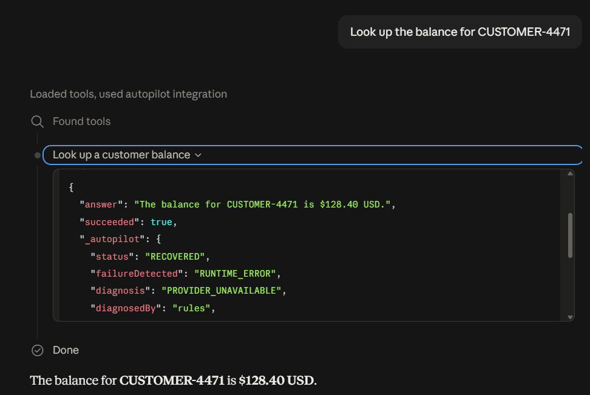

# Autopilot

**A budget-aware reliability harness for RocketRide agents — built entirely on what RocketRide already has.**

## Why this exists

RocketRide already gives you the hard parts of running AI pipelines:

- **Observability** — per-node execution events, lane-level data, timing, resource metrics
- **Orchestration** — a real runtime that schedules and executes pipelines
- **Portability** — swap models, providers and tools without rebuilding the workflow
- **Pipelines as data** — `.pipe` files are plain JSON, and the SDK accepts an in-memory pipeline object

What it deliberately does **not** have is *reliability semantics*. There is no node-level retry, timeout, error handling, or conditional routing anywhere in the `.pipe` schema. When a node fails, that is the developer's problem — and every team solves it the same ad-hoc way: try/catch, a retry loop, a fallback provider, a custom validator, a human on call.

**So the observation Autopilot is built on:** the runtime *already knows* what failed, where, what it cost, and what alternatives are registered. That is everything you need to make a recovery decision. Nobody was using it that way.

Autopilot is a control plane that does. It is not a fork, not a patch, and not a reimplementation — **it is a harness layered on top of the existing runtime**, using only what RocketRide already exposes:

| What Autopilot needs | What RocketRide already provides |
|---|---|
| See a failure | `apaevt_flow` events + task warnings |
| Know what it cost | timing and resource telemetry |
| Know the alternatives | `getServices()` component catalog |
| Change the plan | pipelines are JSON; `use()` takes an object |
| Run the fix | the same engine, same API |
| **Diagnose the failure** | **a RocketRide pipeline** — we use RocketRide to diagnose RocketRide |

Autopilot adds one thing on top: **bounded, verified, side-effect-safe recovery** — configured, not coded.

```
RUN → DETECT → DIAGNOSE → SELECT → BUDGET → GATE → RECOVER → VERIFY → RESUME
                                                                    └→ ESCALATE
```

The developer never writes recovery code. They declare the envelope recovery is allowed to happen inside:

```yaml
budget:
  extra_cost_usd: 0.05
  extra_latency_ms: 4000
  attempts: 3
forbidden:
  - replay_irreversible_write
```

Because there is no resume API, recovery is a **JSON diff on the pipeline** — see [how it works](#how-it-works). That mechanism exists *because* RocketRide made pipelines data, not despite it.

---

## Results

100 tasks × 4 recovery strategies = **400 live runs against a real engine**, seed 42, reproducible from this repo.

| mode | first-pass | **final** | **silent failure** | escalation | $/task | p50 | gain/$ |
|---|---|---|---|---|---|---|---|
| NO_RECOVERY | 77.0% | 72.0% | 5.0% | 23.0% | $0.00000 | 37ms | — |
| RETRY_ONLY | 77.0% | 72.0% | 5.0% | 23.0% | $0.00000 | 53ms | 0.0 |
| FULL_REPLAN | 77.0% | 72.0% | 5.0% | 23.0% | $0.00003 | 74ms | 0.0 |
| **AUTOPILOT** | 72.0% | **86.0%** | **0.0%** | 14.0% | $0.00002 | 109ms | 7729.5 |

**The three identical rows are the point.** Retry-only and full-replan aren't broken — they're doing exactly what they were built to do, and it doesn't help. A schema-drifted response isn't a runtime error: the call succeeded, the pipeline reported success, and there's nothing for a retry to fire on. Full replanning pays ~30× more to reach the same place.

**Autopilot's first-pass rate is *lower* (72% vs 77%) — that's the honest part.** It counts a verifier-rejected first pass as a failure, because the answer was wrong. The baselines counted those same runs as successes. That 5-point gap *is* the silent-failure rate.

Full method, results and six stated limitations: **[docs/benchmark.md](docs/benchmark.md)**

---

## Use it from Claude Desktop

Autopilot ships as an **MCP server**. A real client calls a tool, the agent pipeline fails internally, and the caller receives a working answer — or an honest escalation.

```jsonc
// claude_desktop_config.json  (Settings → Developer → Edit Config)
{
  "mcpServers": {
    "autopilot": {
      "command": "node",
      "args": [
        "--experimental-strip-types",
        "D:\\code\\rocketride\\apps\\mcp-server\\server.ts"
      ]
    }
  }
}
```

Start `pnpm engine` and `pnpm ollama` first, then restart Claude Desktop and ask:

> *"Look up the balance for CUSTOMER-4471"*



**The call succeeded. It also failed.** Claude got a clean answer — *"The balance for CUSTOMER-4471 is $128.40 USD."* — and never saw the outage. The `_autopilot` block is the receipt:

```jsonc
{
  "status": "RECOVERED",
  "failureDetected": "RUNTIME_ERROR",
  "diagnosis": "PROVIDER_UNAVAILABLE",
  "diagnosedBy": "rules",          // rules classified it; no model needed
  "pipelineDiff": [                 // recovery, in full: one field
    "reason.config.custom.base_url -> \"http://127.0.0.1:59460/v1\""
  ],
  "recoveryAttempts": 1
}
```

Then ask it to **charge** that customer:

```jsonc
{
  "succeeded": false,
  "error": "Payment could not be confirmed and was NOT retried. This operation is
            irreversible, so Autopilot cannot safely replay it — the charge may or
            may not have been applied. Escalated for human review.",
  "requiresHumanReview": true,
  "_autopilot": {
    "status": "ESCALATED",
    "recoveryAttempts": 0,
    "rejected": [
      "provider_fallback: blocked: \"payment\" is IRREVERSIBLE_WRITE — autonomous recovery refused",
      "model_escalation: blocked: \"payment\" is IRREVERSIBLE_WRITE — autonomous recovery refused"
    ]
  }
}
```

Both strategies were **affordable**. Both were refused — by safety, not budget. A harness that hid this failure would be worse than no harness.

Verify the whole loop without a GUI:

```bash
pnpm mcp:smoke      # drives the server over real stdio JSON-RPC, 8 assertions
pnpm mcp:inspect    # MCP Inspector UI
```

---

## Quick start

**Requirements:** Node ≥ 20, pnpm ≥ 9. **No API keys. No accounts. No cloud. $0.**

```bash
pnpm install
pnpm setup         # RocketRide engine (~180MB, MIT)
pnpm setup:ollama  # local model, ~2.9GB — installs to D:\tools\ollama
```

Neither installer writes to `C:`. Ollama's official installer hardcodes `C:\Users\...`, so we use the standalone build with an explicit location (override via `AUTOPILOT_OLLAMA_HOME`).

Then, in two terminals:

```bash
pnpm engine     # RocketRide on :5565
pnpm ollama     # local model on :11434
```

First engine boot resolves Python dependencies and takes a few minutes. Later boots take seconds.

Then:

```bash
pnpm demo:d     # the one to watch first
```

---

## See it work

Four scenarios. Each runs a real pipeline against the live engine with deterministic faults injected upstream — real HTTP failures, not mocks.

```bash
pnpm demo       # list all scenarios
pnpm demo:d     # irreversible write  → REFUSAL
pnpm demo:a     # provider failure    → provider fallback
pnpm demo:c     # schema drift        → targeted repair
```

Everything is seeded, so the output is identical every run.

### `pnpm demo:d` — the refusal

The scenario that shows this is a reliability system rather than an agent that tries harder.

```
  1. first pass          completed (9622ms)
  2. FAILURE DETECTED    RUNTIME_ERROR
  3. diagnosed           PROVIDER_UNAVAILABLE
  4. considered 2 strategies, 0 permitted
       ✗ provider_fallback  blocked: "payment" is IRREVERSIBLE_WRITE — autonomous recovery refused
       ✗ model_escalation   blocked: "payment" is IRREVERSIBLE_WRITE — autonomous recovery refused

  status              ESCALATED
  recovery attempts   0
  recovery cost       $0.0000

  This is the refusal. Zero attempts were issued — Autopilot declined
  to act rather than risk replaying an irreversible side effect.
```

A payment failed *after* submission. Autopilot cannot know whether the charge landed, so it refuses. Both strategies were affordable and both were blocked — **by safety, not by budget**.

### `pnpm demo:a` — provider fallback

```
  2. FAILURE DETECTED    RUNTIME_ERROR (HTTP 401)
  3. diagnosed           PROVIDER_UNAVAILABLE
  5. RECOVERY            provider_fallback
       gate: side effect NONE — safe to retry freely
       pipeline diff:
         reason.config.custom.base_url -> "http://127.0.0.1:50454/v1"
  6. verifier expected_field      PASS   output contains "CUSTOMER-4471"

  status              RECOVERED
  recovery attempts   1
```

*(The fallback port is assigned at runtime, so it differs each run.)*

The primary endpoint is genuinely down; the fallback endpoint genuinely works. **Recovery is one line of JSON diff** — see [how it works](#how-it-works).

### `pnpm demo:c` — the silent failure

The most valuable case, and the hardest to catch.

```
  2. verifier schema      FAIL
  2. FAILURE DETECTED    VERIFIER_REJECTION
  3. diagnosed           SCHEMA_MISMATCH
  5. RECOVERY            output_repair
  6. verifier schema      PASS

  status              RECOVERED
```

Nothing errored. The pipeline reported **success** and returned a confident, well-formed, *wrong* answer (`account_ref` / `amount_due` instead of `customerId` / `balance`). No runtime signal existed to catch it — only the verifier did.

---

## Run the benchmark

```bash
pnpm bench:quick   # 25 tasks × 4 modes  (~60s)
pnpm bench         # 100 tasks × 4 modes (~160s, 400 live runs)
```

Writes raw per-run records to `runs/bench-seed42-n100.jsonl` and a summary to `runs/summary-*.json`. Same seed ⇒ same fault schedule ⇒ same table.

```bash
pnpm bench --seed 7 --tasks 50     # any seed, any size
```

---

## Configure it

[`autopilot.config.yaml`](autopilot.config.yaml) is the entire product surface:

```yaml
policy:
  PROVIDER_TRANSIENT:   [retry, provider_fallback]
  PROVIDER_UNAVAILABLE: [provider_fallback, model_escalation]
  SCHEMA_MISMATCH:      [output_repair, model_escalation]
  TOOL_UNAVAILABLE:     [capability_swap]
  # UNKNOWN is deliberately absent — an unclassified failure escalates
  # rather than being guessed at.
```

Per-node safety is declared as a **recovery contract**:

```yaml
search_docs:
  sideEffect: NONE               # retry freely
charge_customer:
  sideEffect: IRREVERSIBLE_WRITE # never autonomously replayed
```

**A node with no declared contract defaults to unsafe.** Fail closed, always.

Every dollar figure resolves against [`prices.json`](prices.json) — an undeclared model *throws* rather than silently costing zero.

---

## How it works

RocketRide has **no resume API**. But pipelines are portable JSON and the SDK accepts an in-memory pipeline object, so:

> **Autopilot doesn't resume a pipeline. It synthesizes a new one.**

On failure at node N: keep what already succeeded, rebuild only N and everything downstream, apply the strategy's JSON diff, and run that.

```
original                          residual (synthesized at runtime)
────────────────────              ──────────────────────────────────
retrieve ─┐                       [cached: retrieve, crm outputs]
crm ──────┼→ reason → out                      ↓
                                        reason' → out
  base_url: "…/primary"                   base_url: "…/secondary"   ← the recovery
```

Every strategy is a deterministic, printable, testable JSON transformation:

| strategy | rewrite |
|---|---|
| `retry` | re-run unchanged |
| `provider_fallback` | swap the endpoint |
| `model_escalation` | swap the model up the declared ladder |
| `capability_swap` | replace the component with another implementation |
| `output_repair` | prepend a repair pass |
| `escalate` | emit nothing, hand to a human |

**No model decides *which recovery to run*.** That's why it stays reproducible enough to benchmark honestly.

### Where the LLM does sit

Two places, and the boundary between them is deliberate:

| Stage | Who decides | Why |
|---|---|---|
| **Detect** | deterministic | Never ask a model whether HTTP 401 is a failure. |
| **Diagnose** | rules first, **then an LLM** | Known signatures are classified for free. Anything rules return `UNKNOWN` for goes to a local model — *this* is "an LLM reads the trace and infers the cause". |
| **Policy / Budget / Gate** | deterministic | These encode the developer's declared limits and safety. A model must never widen what recovery is permitted. |
| **Verify** | deterministic | A model grading its own recovery is not verification. |

The diagnoser is itself a **RocketRide pipeline** — we use RocketRide to diagnose RocketRide failures:

```
webhook(trace) → prompt(classification rules) → llm_openai_api → response_answers
```

Its output is **parsed, not obeyed**. Only an exact, unambiguous match against the eight-class enum is accepted; prose, invented classes, multiple classes, an injected instruction, or a timeout all collapse to `UNKNOWN` → escalate. Tested adversarially — including that `"this is not PROVIDER_TRANSIENT"` is rejected rather than read as selecting it.

Responses report `diagnosedBy: "rules" | "llm"`, so the model's contribution is measurable rather than assumed.

One refinement worth noting: upstream nodes that are *free* to recompute (pure transforms) are re-run rather than cached — cheaper than plumbing values back in. Only expensive upstream work is preserved.

---

## Architecture

```
        RocketRide Engine (:5565)
                 │  apaevt_flow / status events
        ┌────────▼────────┐
        │     ADAPTER     │  ← the ONLY package importing `rocketride`
        └────────┬────────┘
════════════════════════════════════════════════
        AUTOPILOT CONTROL PLANE (pure TypeScript)

   DETECTOR → DIAGNOSER → POLICY → BUDGET → GATE
   did it     why?        which    can we   is it
   fail?                  options? afford?  safe?
                                      │
                                 EXECUTOR (JSON rewrite)
                                      │
                                  VERIFIER
                              ┌───────┴───────┐
                          RECOVERED       ESCALATED
```

**The seam:** only `packages/adapter` touches RocketRide. Everything above the line is pure TypeScript over an event model, fully testable with the engine switched off — and `pnpm check:seam` makes that a **build failure**, not a code-review convention.

**Two invariants enforced structurally, not by discipline:**

1. `RECOVERED` is unreachable except through a passing verifier — there is exactly one transition into it.
2. The side-effect gate is the only place a `PermittedProposal` can be constructed (a real runtime `Symbol`), so an executor cannot run for an unsafe node. A forged object fails the check.

```
packages/
  core/          types, pure state machine, graph slicing, side-effect gate
  diagnosis/     detector (did it fail?) + diagnoser (why?)
  control/       policy, budget, cost estimation, selection
  verify/        deterministic verifiers
  chaos/         seeded fault injection (LLM proxy + MCP server)
  adapter/       ⚠ RocketRide SDK, residual synthesis, rewrites
  orchestrator/  the driver + benchmark runner
apps/demo-agent/ scenarios, CLI, benchmark CLI
```

---

## Verify the build

```bash
pnpm verify      # typecheck + seam check + 116 tests
```

The control plane is tested with **no engine running** — that's the point of the seam. Notable tests: the gate blocks irreversible writes with zero executor invocations; a forged proposal can't fake the gate brand; the same seed produces byte-identical fault schedules.

---

## What's built, and what isn't

**Working end to end:** scenarios A, C, D live against the engine; the 4-mode benchmark; seeded deterministic fault injection; residual pipeline synthesis; side-effect contracts; multidimensional budgets.

**Not built:**
- **Scenario B (capability substitution).** Designed and unit-tested — a real external MCP server failing over to RocketRide's native `tool_filesystem`. The fault-injecting MCP server exists; it isn't wired to a live pipeline yet.
- **The web report UI.** Scoped as stretch; the benchmark table was the priority.

**Honest limitations:**
- **The benchmark uses a deterministic stand-in, not a real model** — and always will. Measuring silent-failure rate *requires* known-correct answers for every task, which a real model's nondeterminism destroys. The demo and MCP server use a real model; the benchmark deliberately does not. Both modes share the same fault injector, so the recovery logic under test is identical.
- **Dollar figures are modelled, not spent.** They resolve against `prices.json` applied to real call volumes. The harness costs $0 to run.
- All limitations: [docs/benchmark.md](docs/benchmark.md).

---

## Findings

Building this surfaced several things about RocketRide that aren't in its docs — all verified against a live engine, written up in **[docs/architecture.md](docs/architecture.md)**:

- **LLM node errors never surface as pipeline failures.** The engine catches its own exception and writes `"**LLM error** — ..."` into a *successful-looking* answer. The real detail lands in `getTaskStatus().warnings[]`. A detector watching only the event stream sees nothing.
- **The engine has its own retry loop** (5×, exponential backoff) that absorbs transient faults before Autopilot sees them. Correct layering — Autopilot should only see what the engine couldn't fix — but it means faults must be modelled per pipeline run.
- **One logical LLM call is three HTTP calls** (probe, streaming attempt, non-streaming answer).
- **Pipeline instantiation costs ~10.9s; execution costs ~28ms.** Caching instances made a 400-run benchmark practical.
- **There is no literal/constant node**, and a node with no inbound edge is never scheduled — which is what shaped the residual synthesis design.

---

## Credits

Built on [RocketRide](https://github.com/rocketride-org/rocketride-server) (MIT). Architecturally inspired by research framing agent reliability as a bounded orchestration-control problem — separating detection, diagnosis, recovery and verification under explicit budgets.

MIT licensed.
